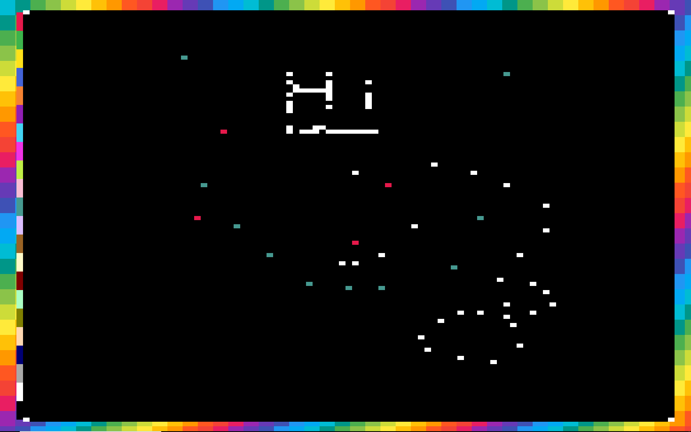
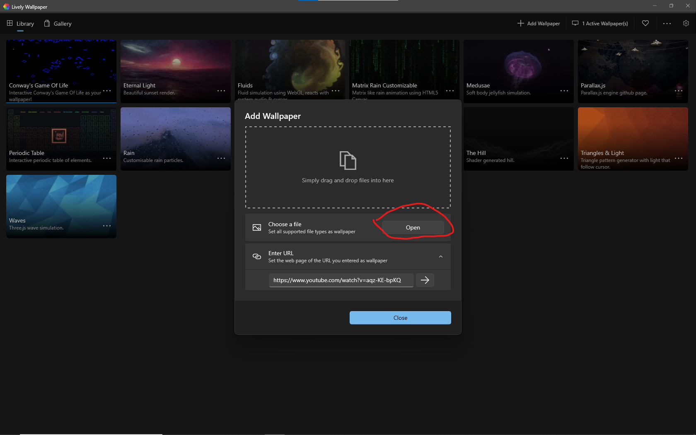

# Scrawlpaper

**Installation:**

1. Download and install [Lively Wallpaper](https://www.rocksdanister.com/lively/)
2. Download this repo as a zip file
3. Find and unzip the file
4. Open Lively Wallpaper
5. Select 'Add Wallpaper'

6. Select 'Open'

7. Find where your unzipped folder is, and open 'index.html'
8. 
9. Set the title to one of your choice (I would use Scrawlpaper)
10. When done, click the 'OK' button
11. Voila! Your wallpaper is now Scrawlpaper!

If it did not set it as your wallpaper, click it if it is in the wallpaper list. If it is not in your wallpaper list, try re-adding it. If that fails, join the discord server by clicking on my name (ProfessorFish) in the credits below.

**Customisation and usage:**
-
You can access the customisation options by clicking on the three dots next to the wallpaper and selecting 'Customise'

There are several options for customisation:

- Brush colour: The colour of your brush. ***Note: this enables more colours than those provided on the left of the screen***
- Background URL: URL to the image to be displayed as the background (areas that are not covered by the canvas).
- Set background: Sets the background to the URL specified in the Background URL option.

**Clicking on the colours on the far left of the canvas change the colour of your brush!**

# Credits

- [ProfessorFish](https://discord.gg/u9gFdnu) - Creator of scrawlpaper
- https://reddit.com/r/Place - Original idea
